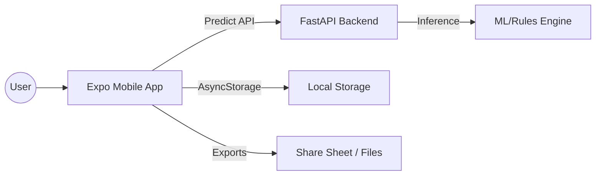
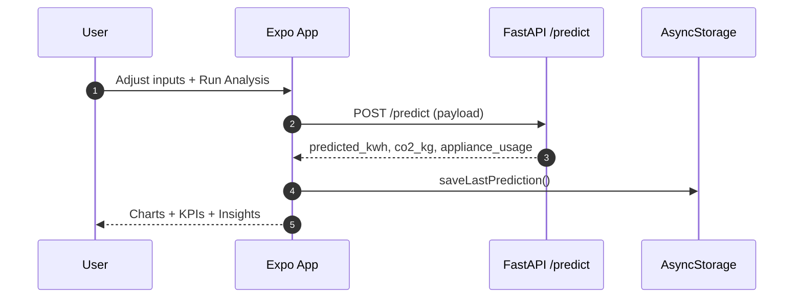
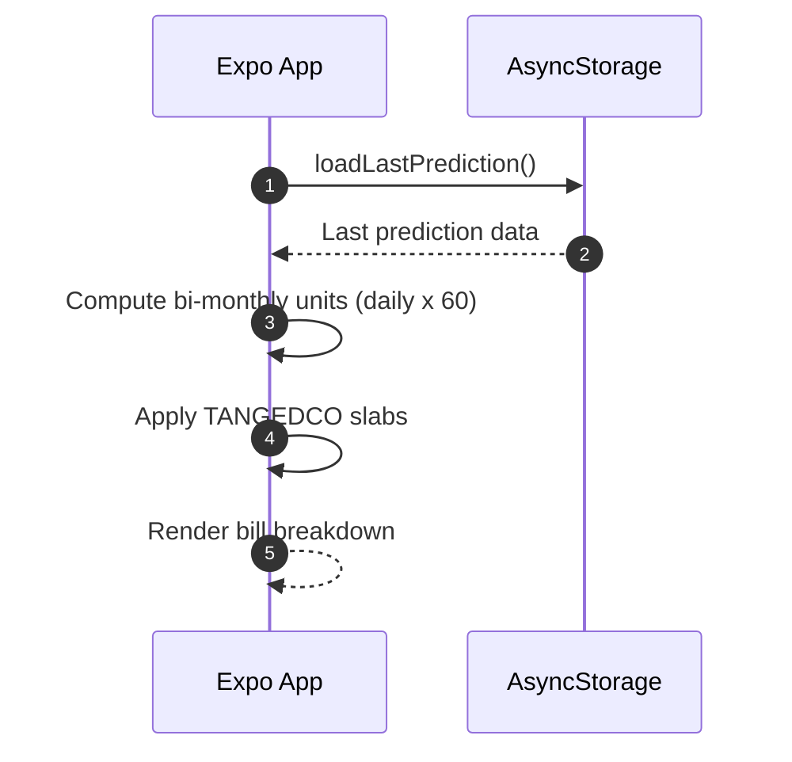

EcoSync
=======

EcoSync is a smart energy analytics app with a React Native (Expo) client and a FastAPI backend. The mobile app visualizes usage, predicts consumption, estimates CO2 impact, and calculates Chennai TANGEDCO bills. The backend serves prediction endpoints and related data.

Highlights
----------
- Mobile app: Expo Router, charts, analytics, billing, and exports (CSV/PDF/JPEG)
- Backend: FastAPI prediction API
- Deploy backend to Render for a public API base
- Clean data flow with persistent prediction storage across tabs

Repo Structure
--------------
- main.py: FastAPI backend (prediction API)
- requirements.txt: Python backend dependencies
- render.yaml: Render deployment config
- client/ecosync-app: Expo app

Architecture Overview
---------------------


Data Flow (Prediction)
----------------------


Data Flow (Bills)
-----------------


Mobile App (Expo)
-----------------
Location: client/ecosync-app

Key Features
------------
- Analysis dashboard (charts, heatmap, trends)
- Home KPI summary synced from analysis
- Bills calculator for Chennai TANGEDCO slabs
- Export usage data as CSV; export bills as PDF/JPEG

Run Locally
-----------
1) Install dependencies

```bash
cd client/ecosync-app
npm install
```

2) Set environment variables

Create client/ecosync-app/.env

```dotenv
EXPO_PUBLIC_API_BASE=https://YOUR-RENDER-APP.onrender.com
EXPO_PUBLIC_SUPABASE_URL=https://YOUR-PROJECT.supabase.co
EXPO_PUBLIC_SUPABASE_ANON_KEY=YOUR_ANON_KEY
```

3) Start the app

```bash
npx expo start
```

Backend (FastAPI)
-----------------
Location: main.py

Local Run
---------
```bash
python -m venv venv
venv\Scripts\activate
pip install -r requirements.txt
uvicorn main:app --reload
```

Render Deployment
-----------------
This repo includes render.yaml for one-click deployment.

Steps
-----
1) Push this repo to GitHub.
2) Create a new Web Service in Render and connect the repo.
3) Render will read render.yaml and build the service.
4) After deploy, copy the Render service URL and set it as:

EXPO_PUBLIC_API_BASE=https://YOUR-RENDER-APP.onrender.com

render.yaml (expected)
----------------------
- Build: pip install -r requirements.txt
- Start: uvicorn main:app --host 0.0.0.0 --port 10000

Notes
-----
- Render assigns port 10000 by default. Ensure your service binds to it.
- If you need secrets, use Render environment variables (not in .env).

Environment Variables
---------------------
Client (.env)
- EXPO_PUBLIC_API_BASE
- EXPO_PUBLIC_SUPABASE_URL
- EXPO_PUBLIC_SUPABASE_ANON_KEY

Server (Render)
- Any model/config keys required by main.py (if applicable)

Bill Calculation (Chennai TANGEDCO)
-----------------------------------
- Bi-monthly billing: daily kWh x 60
- Free tier: <=100 units
- Slab-based pricing for units above 100

Testing Checklist
-----------------
- App loads without crash
- Run Analysis returns prediction and updates Home tab
- Bills tab shows correct breakdown
- Exports: CSV, PDF, JPEG
- API reachable from mobile device

Troubleshooting
---------------
- If analysis fails: check EXPO_PUBLIC_API_BASE
- If build fails: verify env vars included in EAS build
- If splash is stale: run expo prebuild --clean and rebuild

License
-------
For academic use.
