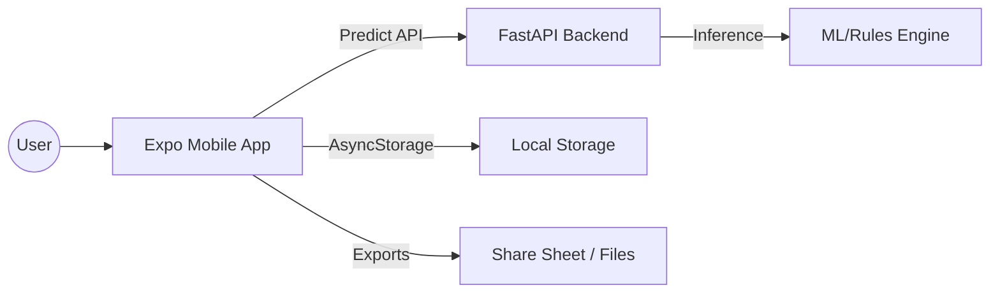
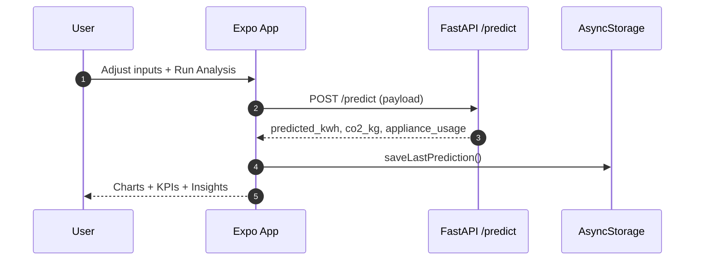
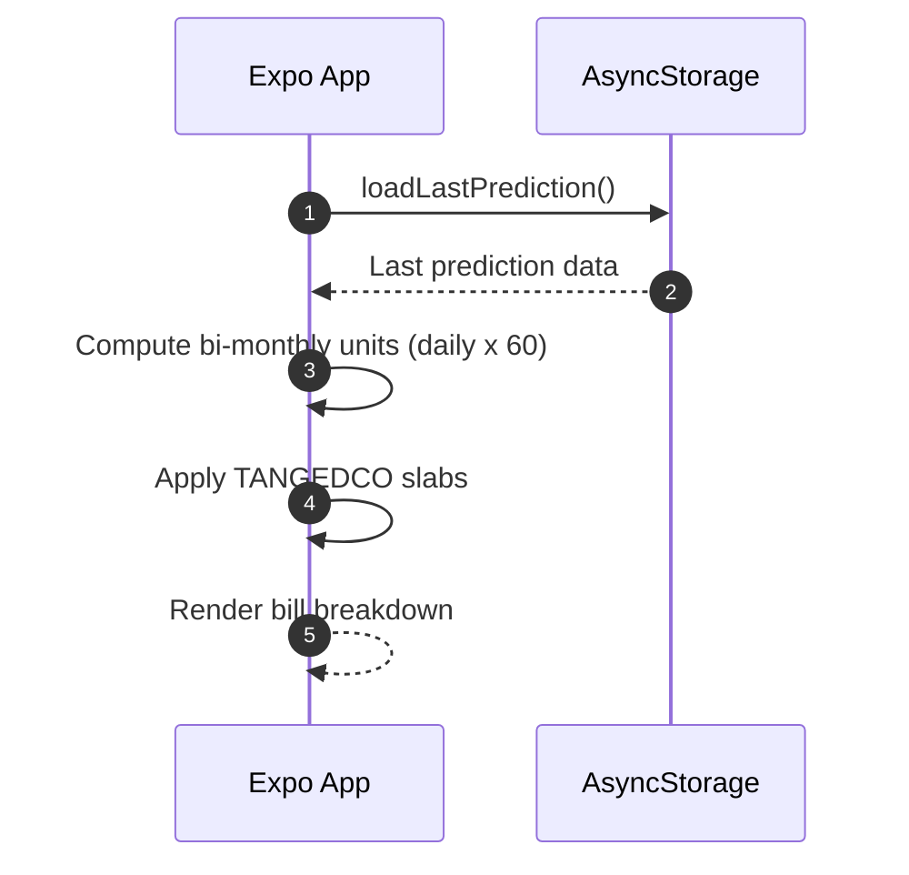
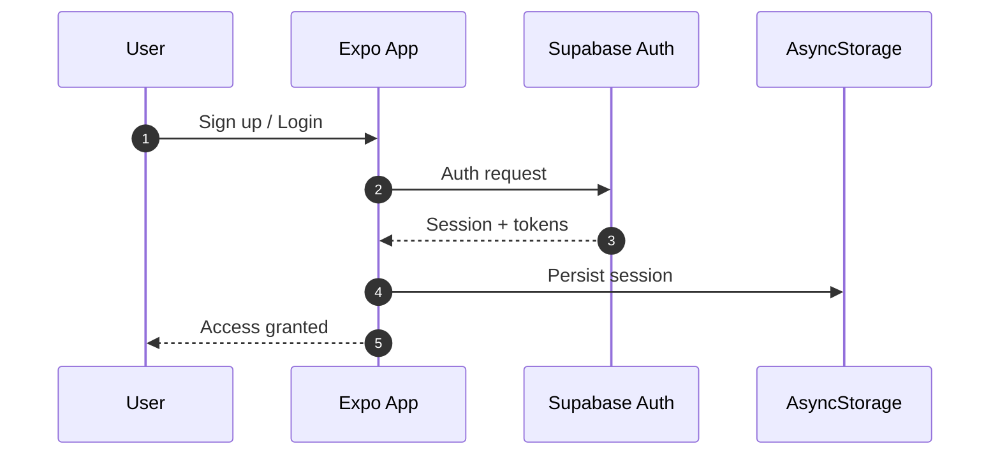
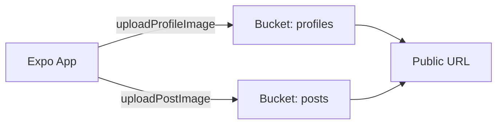
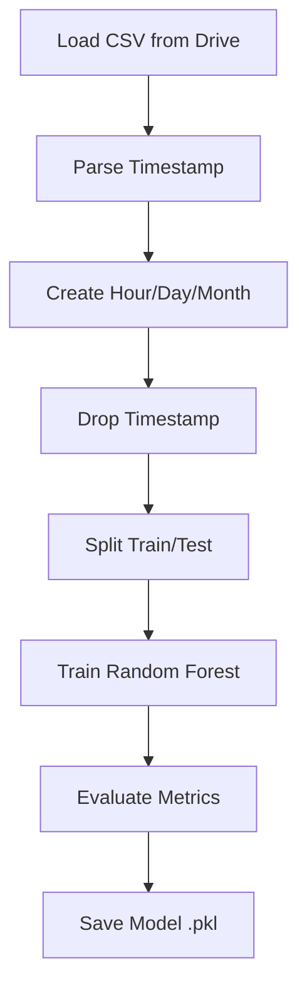
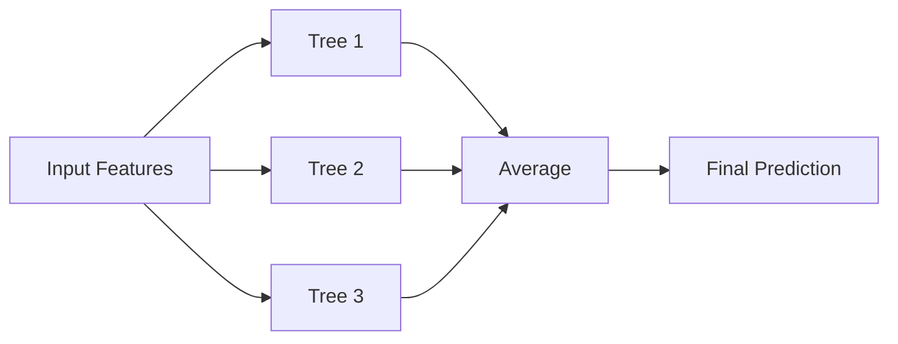

<a id="top"></a>

# EcoSync

EcoSync is a full-stack smart energy analytics platform that combines a React Native (Expo) mobile app, a FastAPI inference backend, and a trained RandomForest model for household electricity prediction.

It helps users estimate daily power usage, CO2 emissions, appliance-level impact, and Chennai TANGEDCO bi-monthly bills, while also supporting auth, profile management, and media-based community posting through Supabase.


## Quick Navigation

| Topic | Jump |
|---|---|
| Why EcoSync | [Go](#why-ecosync) |
| Feature Matrix | [Go](#feature-matrix) |
| App Walkthrough | [Go](#app-walkthrough) |
| Screenshots | [Go](#screenshots) |
| Architecture Overview | [Go](#architecture-overview) |
| Data Flow: Prediction | [Go](#data-flow-prediction) |
| Data Flow: Bills | [Go](#data-flow-bills) |
| Auth and Storage | [Go](#auth-and-storage) |
| ML Model Training | [Go](#ml-model-training) |
| Backend API | [Go](#backend-api) |
| Local Setup | [Go](#local-setup) |
| Deployment | [Go](#deployment) |
| Billing Logic (Chennai TANGEDCO) | [Go](#billing-logic-chennai-tangedco) |
| Testing Checklist | [Go](#testing-checklist) |
| Troubleshooting | [Go](#troubleshooting) |
| Project Structure | [Go](#project-structure) |
| Roadmap | [Go](#roadmap) |
| Contributing | [Go](#contributing) |
| License | [Go](#license) |

## Why EcoSync

- Combines ML prediction, environmental impact, and tariff estimation in one app.
- Keeps user flow practical: analysis output is persisted and reused in Home and Bills tabs.
- Supports real user lifecycle: auth, onboarding guard, profile image updates, social media posts.
- Includes export paths for reporting and sharing: CSV (analysis), PDF/JPEG (bills).

[Back to top](#top)

## Feature Matrix

| Layer | What it does | Key technologies |
|---|---|---|
| Mobile App | Dashboard, analysis controls, charting, bill estimation, exports, posts, profile | Expo, Expo Router, React Native, Chart Kit |
| Backend API | Hosts prediction endpoint and serves inference results | FastAPI, Uvicorn |
| ML Engine | Predicts energy usage from environmental and appliance inputs | scikit-learn RandomForestRegressor, NumPy, Joblib |
| Auth + Storage | User sessions and media storage for profiles/posts | Supabase Auth, Supabase Storage |
| Deployment | Public API hosting + mobile build profiles | Render, EAS |

[Back to top](#top)

## App Walkthrough

### Home
- Shows a quick summary (`predicted_kwh`, `co2_kg`, top appliance, solar offset).
- Loads persisted prediction if available; otherwise triggers a default prediction.
- Refresh action re-runs summary and updates local storage.

### Analysis
- Main interactive dashboard for prediction.
- Slider-driven inputs for weather, occupancy, and appliance loads.
- Multiple views: overview, appliance analytics, room heatmap, emission insights.
- Exports appliance report as CSV.

### Bills
- Reads latest persisted analysis result.
- Converts daily prediction to bi-monthly units (`daily * 60`).
- Applies Chennai TANGEDCO slabs and shows breakdown.
- Exports bill report as PDF and JPEG.

### Posts
- Feed-style media posts with image + optional description.
- Supports camera or gallery uploads.
- Uses Supabase storage and fetches active posts.

### Profile
- Displays user identity and profile photo.
- Supports profile image upload to Supabase bucket.
- Supports sign-out flow.

### Auth and Onboarding
- Route guard controls access by auth state.
- Unauthenticated users are redirected to login.
- Authenticated users without onboarding completion are redirected to onboarding.
- Completed users are routed to app tabs.

[Back to top](#top)

## Screenshots

Add screenshots here to make the project easy to review.

- Home: `screenshots/home.png`
- Analysis: `screenshots/analysis.png`
- Bills: `screenshots/bills.png`
- Profile: `screenshots/profile.png`

[Back to top](#top)

## Architecture Overview



[Back to top](#top)

## Data Flow: Prediction



[Back to top](#top)

## Data Flow: Bills



[Back to top](#top)

## Auth and Storage

EcoSync uses Supabase for authentication and media storage. Sessions are persisted locally with AsyncStorage and auto-refresh behavior is enabled in the app.

### Auth Flow



### Storage Buckets

- `profiles`: profile images (upsert path pattern by user ID)
- `posts`: post media (unique file path per upload)

### Storage Flow (Uploads)



### Implementation Notes

- Profile image path pattern: `{userId}/profile.{ext}`
- Post image path pattern: `{userId}/{timestamp}.{ext}`
- Uploaded media URLs are returned and displayed in-app

[Back to top](#top)

## ML Model Training

Notebook: `p2bl_project.ipynb`

The training pipeline builds a `RandomForestRegressor` using Chennai home-energy data and persists the model to `.pkl` for backend inference.

### Training Pipeline

1. Load dataset from Google Drive
2. Parse timestamp into `Hour`, `Day`, `Month`
3. Split into train/test sets
4. Train RandomForestRegressor
5. Evaluate with MAE, RMSE, R2
6. Save model to `.pkl`

### Why RandomForestRegressor

- Handles non-linear relationships between inputs and energy output
- Stable with noisy real-world usage data
- Works with minimal feature scaling
- Good baseline performance with low tuning overhead

### Notebook Training Flow



### Random Forest Working (High Level)



### Random Forest Intuition

Random Forest builds many decision trees over random subsets of samples and features. Each tree predicts usage; the final output is the average across trees, improving robustness and reducing overfitting.

[Back to top](#top)

## Backend API

### Base URL

The mobile app reads API origin from:

- `EXPO_PUBLIC_API_BASE`

Example:

```dotenv
EXPO_PUBLIC_API_BASE=https://YOUR-BACKEND.onrender.com
```

### Endpoints

- `GET /` -> health/status response
- `POST /predict` -> inference endpoint

### Request JSON (`POST /predict`)

```json
{
  "temperature": 32,
  "humidity": 70,
  "occupancy": 4,
  "ac": 2,
  "fan": 0.3,
  "fridge": 0.1,
  "plug": 0.5,
  "kitchen": 0.7,
  "pump": 0.2,
  "lighting": 0.3,
  "solar": 0.5
}
```

### Response JSON

```json
{
  "predicted_kwh": 5.42,
  "co2_kg": 4.4444,
  "highest_appliance": "AC",
  "green_percent": 9.22,
  "appliance_usage": {
    "AC": 2,
    "Fan": 0.3,
    "Fridge": 0.1,
    "Plug": 0.5,
    "Kitchen": 0.7,
    "Pump": 0.2,
    "Lighting": 0.3
  }
}
```

### Validation and Runtime Notes

- Request body uses Pydantic validation (`temperature`, `humidity`, `occupancy` are bounded).
- Backend currently allows all CORS origins (`allow_origins=["*"]`) for demo/academic use.
- Model file path is configurable via `MODEL_PATH` (default: `Energy_Usage_Prediction_Model.pkl`).

[Back to top](#top)

## Local Setup

### Prerequisites

- Node.js 18+
- npm 9+
- Python 3.10+
- Expo CLI / `npx expo`

### Setup Matrix

| Target | Location | Command |
|---|---|---|
| Install mobile deps | `client/ecosync-app` | `npm install` |
| Run Expo app | `client/ecosync-app` | `npx expo start` |
| Create Python venv | repo root | `python -m venv venv` |
| Activate venv (PowerShell) | repo root | `venv\Scripts\Activate.ps1` |
| Install backend deps | repo root | `pip install -r requirements.txt` |
| Run backend | repo root | `uvicorn main:app --reload --host 0.0.0.0 --port 10000` |

### Environment Variables

| Scope | Variable | Required | Purpose |
|---|---|---|---|
| Mobile | `EXPO_PUBLIC_API_BASE` | Yes | Backend API base URL |
| Mobile | `EXPO_PUBLIC_SUPABASE_URL` | Yes | Supabase project URL |
| Mobile | `EXPO_PUBLIC_SUPABASE_ANON_KEY` | Yes | Supabase public anon key |
| Backend | `MODEL_PATH` | Optional | Override default model file path |
| Backend | `PORT` | Optional | Server port (Render commonly uses `10000`) |

### `.env` Example (`client/ecosync-app/.env`)

```dotenv
EXPO_PUBLIC_API_BASE=https://YOUR-BACKEND.onrender.com
EXPO_PUBLIC_SUPABASE_URL=https://YOUR-PROJECT.supabase.co
EXPO_PUBLIC_SUPABASE_ANON_KEY=YOUR_ANON_KEY
```

[Back to top](#top)

## Deployment

### Render (Backend)

`render.yaml` is currently present in the repo but has no service content, so deployment should be configured manually in Render.

Manual steps:

1. Push repository to GitHub.
2. Create a new **Web Service** in Render.
3. Set Build Command: `pip install -r requirements.txt`
4. Set Start Command: `uvicorn main:app --host 0.0.0.0 --port 10000`
5. Add environment variable if needed: `MODEL_PATH`
6. Deploy and copy your Render service URL.
7. Set `EXPO_PUBLIC_API_BASE` in the app environment to that URL.

### EAS Build Profiles (from `client/ecosync-app/eas.json`)

- `development`: internal distribution, development client enabled
- `preview`: internal APK distribution for Android
- `production`: app version auto-increment enabled

Each profile expects these env keys to be available:
- `EXPO_PUBLIC_API_BASE`
- `EXPO_PUBLIC_SUPABASE_URL`
- `EXPO_PUBLIC_SUPABASE_ANON_KEY`

[Back to top](#top)

## Billing Logic (Chennai TANGEDCO)

Bill estimation in the mobile app follows these rules:

- Bi-monthly unit estimate: `predicted_daily_kwh * 60`
- Free tier: if bi-monthly units `<= 100`, final amount is `0`
- Above 100 units: slab-wise tariff is applied cumulatively

Configured slabs in app logic:

- `0-400` -> `INR 4.95`
- `401-500` -> `INR 6.65`
- `501-600` -> `INR 8.80`
- `601-800` -> `INR 9.95`
- `801-1000` -> `INR 11.05`
- `1000+` -> `INR 12.15`

[Back to top](#top)

## Testing Checklist

- App boots to auth flow without crashes.
- Route guard redirects correctly for:
  - unauthenticated users
  - authenticated users pending onboarding
  - fully onboarded users
- Analysis run returns prediction and persists result.
- Home reads and displays persisted analysis summary.
- Bills tab loads stored prediction and computes slabs correctly.
- CSV export works from Analysis.
- PDF and JPEG exports work from Bills.
- Supabase login/signup/session restore works.
- Profile image upload works and URL renders correctly.
- Post creation/upload works and feed refreshes.
- Backend `/predict` reachable from device/emulator.

[Back to top](#top)

## Troubleshooting

### Quick Index

- [Missing API base URL](#missing-api-base-url)
- [Prediction request fails](#prediction-request-fails)
- [Supabase auth/storage issues](#supabase-authstorage-issues)
- [Build or EAS env mismatch](#build-or-eas-env-mismatch)
- [Exports not working](#exports-not-working)

### Missing API base URL

If app startup throws missing `EXPO_PUBLIC_API_BASE`, confirm `client/ecosync-app/.env` exists and restart Expo after editing env values.

### Prediction request fails

- Verify backend is running and reachable from your device.
- Confirm `EXPO_PUBLIC_API_BASE` points to the correct deployed/local API.
- Check backend logs for validation errors on request payload.

### Supabase auth/storage issues

- Validate `EXPO_PUBLIC_SUPABASE_URL` and `EXPO_PUBLIC_SUPABASE_ANON_KEY`.
- Check bucket names are exactly `profiles` and `posts`.
- Ensure storage policies allow intended read/write operations.

### Build or EAS env mismatch

- Confirm EAS profile env values are set for the target profile.
- Rebuild after changing env config.
- If Android native state is stale, run a clean prebuild and rebuild.

### Exports not working

- CSV/PDF/JPEG exports require prediction data first.
- On physical devices, confirm share sheet availability.
- For JPEG capture, ensure bill report view has rendered before export.

[Back to top](#top)

## Project Structure

```text
ecosync/
|-- main.py
|-- requirements.txt
|-- render.yaml
|-- Energy_Usage_Prediction_Model.pkl
|-- p2bl_project.ipynb
|-- Readme.md
`-- client/
    `-- ecosync-app/
        |-- app/
        |   |-- _layout.tsx
        |   |-- (auth)/
        |   |   |-- _layout.tsx
        |   |   |-- login.tsx
        |   |   |-- signup.tsx
        |   |   `-- onboarding.tsx
        |   `-- (tabs)/
        |       |-- _layout.tsx
        |       |-- index.tsx
        |       |-- analysis.tsx
        |       |-- bills.tsx
        |       |-- post.tsx
        |       `-- profile.tsx
        |-- lib/
        |   |-- api.ts
        |   |-- billing.ts
        |   |-- energy-summary.ts
        |   `-- supabase/
        |       |-- client.ts
        |       `-- storage.ts
        |-- app.json
        |-- eas.json
        `-- package.json
```

[Back to top](#top)

## Roadmap

- Add backend model version endpoint and metadata in API response.
- Add automated tests for billing and prediction API contracts.
- Add CI checks for lint, type-check, and backend smoke tests.
- Improve post feed moderation and post lifecycle visibility.
- Add a formal OSS license file and contribution templates.

[Back to top](#top)

## Contributing

1. Fork the repo and create a feature branch.
2. Keep changes scoped and include clear commit messages.
3. Run app/backend locally and verify checklist items you touched.
4. Open a PR with:
   - change summary
   - screenshots (if UI changes)
   - test notes

[Back to top](#top)

## License

For academic use.

[Back to top](#top)

