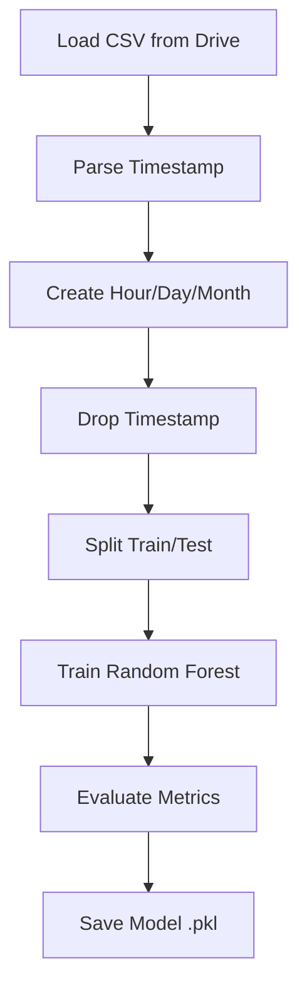
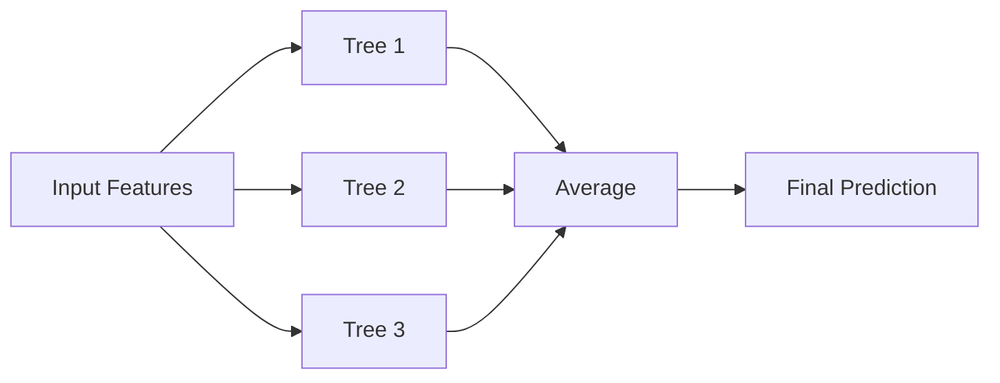
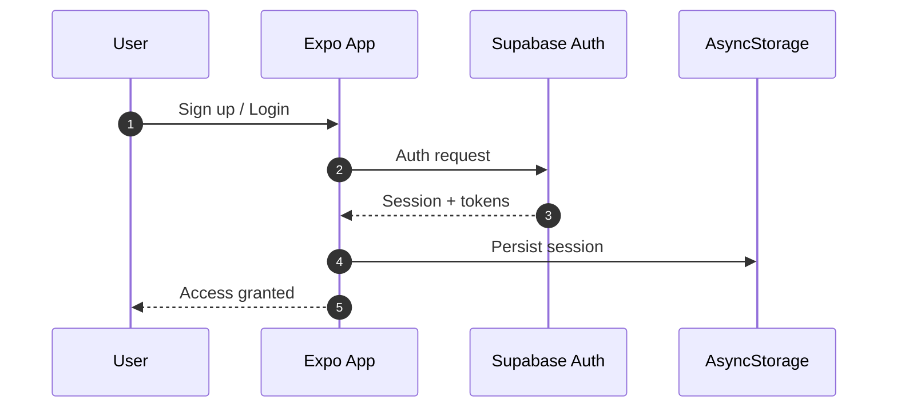
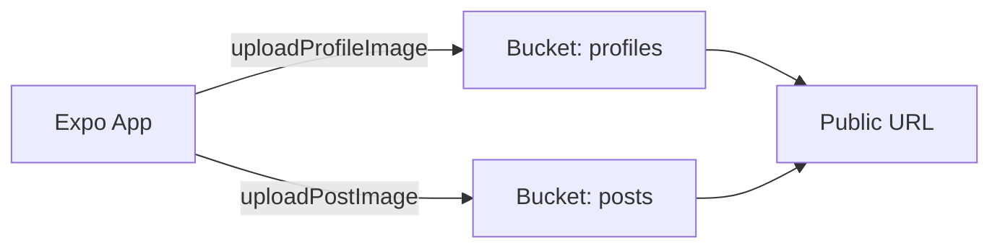
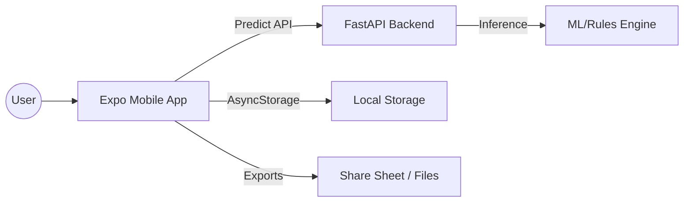
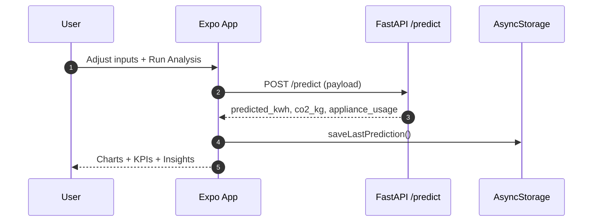
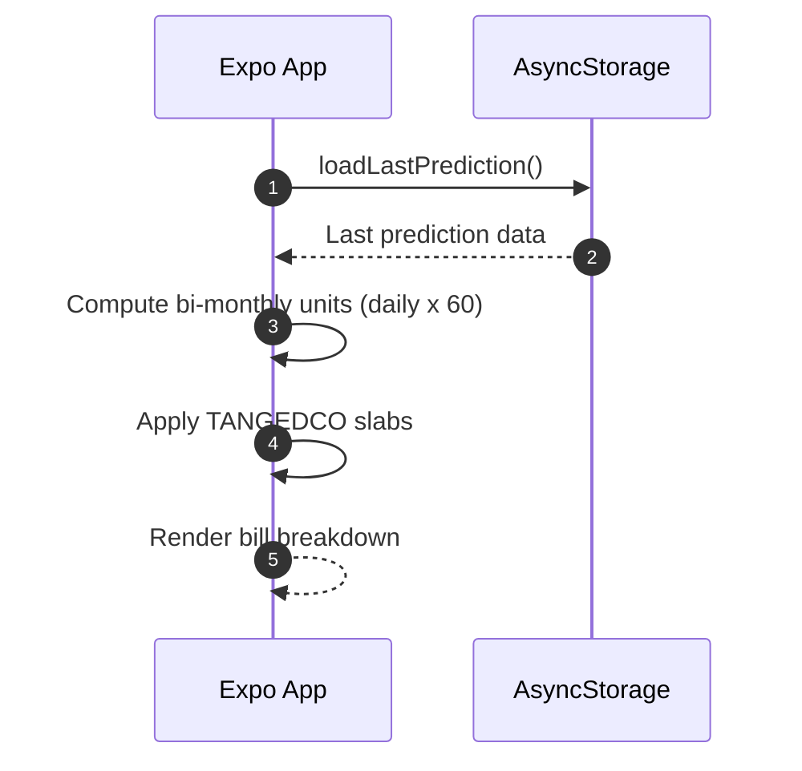

EcoSync
=======

EcoSync is a smart energy analytics app with a React Native (Expo) client and a FastAPI backend. The mobile app visualizes usage, predicts consumption, estimates CO2 impact, and calculates Chennai TANGEDCO bills. The backend serves prediction endpoints and related data.

Table of Contents
-----------------
- Highlights
- Demo
- Screenshots
- Tech Stack
- Supabase Auth and Storage
- Model Training (Notebook)
- Repo Structure
- Architecture Overview
- Data Flow (Prediction)
- Data Flow (Bills)
- Mobile App (Expo)
- Backend (FastAPI)
- API Contract
- Render Deployment
- Environment Variables
- Bill Calculation (Chennai TANGEDCO)
- Build Profiles
- Testing Checklist
- Troubleshooting
- License

Highlights
----------
- Mobile app: Expo Router, charts, analytics, billing, and exports (CSV/PDF/JPEG)
- Backend: FastAPI prediction API
- Deploy backend to Render for a public API base
- Clean data flow with persistent prediction storage across tabs

Demo
----
- Mobile demo: run the Expo app locally or install the APK.
- Backend demo: deploy FastAPI on Render and point the app to it.

Screenshots
-----------
Add screenshots here to make the project easy to review.

- Home: screenshots/home.png
- Analysis: screenshots/analysis.png
- Bills: screenshots/bills.png
- Profile: screenshots/profile.png

Tech Stack
----------
Mobile
- Expo (React Native)
- Expo Router
- React Native Chart Kit
- AsyncStorage
- Expo Print, Expo Sharing, View Shot
- Supabase Auth and Storage

Backend
- FastAPI
- Uvicorn

ML
- RandomForestRegressor (scikit-learn)
- Pandas, NumPy
- Joblib for model persistence

Infra
- Render (API hosting)
- Supabase (Auth + Storage)

Model Training (Notebook)
-------------------------
Notebook: p2bl_project.ipynb

The model training pipeline uses a RandomForestRegressor on a Chennai home energy dataset. The workflow:

1) Load dataset from Google Drive
2) Convert Timestamp into Hour, Day, Month features
3) Split into train/test
4) Train RandomForestRegressor
5) Evaluate (MAE, RMSE, R2)
6) Save model to Google Drive as .pkl

Why RandomForestRegressor
-------------------------
- Handles non-linear relationships between usage patterns and inputs
- Robust to outliers and noisy sensor readings
- Requires minimal feature scaling
- Provides strong performance with limited tuning
- Works well with mixed feature types (continuous + categorical-like)

Notebook Training Flow
----------------------


Random Forest Working (High Level)
----------------------------------


Random Forest (Intuition)
-------------------------
Random Forest builds many decision trees on random subsets of data and features. Each tree predicts energy usage, and the final output is the average of all tree predictions. This reduces overfitting and improves stability.

Supabase Auth and Storage
-------------------------
EcoSync uses Supabase for authentication and media storage. Auth sessions are persisted locally using AsyncStorage and auto-refresh tokens are enabled.

Auth Flow
---------


Storage Buckets
---------------
- profiles: profile images (upsert by userId)
- posts: post media (unique files per upload)

Storage Flow (Uploads)
----------------------


Implementation Notes
--------------------
- Profile image path: {userId}/profile.{ext}
- Post image path: {userId}/{timestamp}.{ext}
- Public URLs are returned for display after upload

Repo Structure
--------------
- main.py: FastAPI backend (prediction API)
- requirements.txt: Python backend dependencies
- render.yaml: Render deployment config
- client/ecosync-app: Expo app

Architecture Overview
---------------------


Data Flow (Prediction)
----------------------


Data Flow (Bills)
-----------------


Mobile App (Expo)
-----------------
Location: client/ecosync-app

Key Features
------------
- Analysis dashboard (charts, heatmap, trends)
- Home KPI summary synced from analysis
- Bills calculator for Chennai TANGEDCO slabs
- Export usage data as CSV; export bills as PDF/JPEG

Run Locally
-----------
1) Install dependencies

```bash
cd client/ecosync-app
npm install
```

2) Set environment variables

Create client/ecosync-app/.env

```dotenv
EXPO_PUBLIC_API_BASE=https://YOUR-RENDER-APP.onrender.com
EXPO_PUBLIC_SUPABASE_URL=https://YOUR-PROJECT.supabase.co
EXPO_PUBLIC_SUPABASE_ANON_KEY=YOUR_ANON_KEY
```

3) Start the app

```bash
npx expo start
```

Backend (FastAPI)
-----------------
Location: main.py

Local Run
---------
```bash
python -m venv venv
venv\Scripts\activate
pip install -r requirements.txt
uvicorn main:app --reload
```

API Contract
------------
Base URL
- EXPO_PUBLIC_API_BASE

Endpoint
- POST /predict

Request (JSON)
```json
{
	"temperature": 32,
	"humidity": 70,
	"occupancy": 4,
	"ac": 2,
	"fan": 0.3,
	"fridge": 0.1,
	"plug": 0.5,
	"kitchen": 0.7,
	"pump": 0.2,
	"lighting": 0.3,
	"solar": 0.5
}
```

Response (JSON)
```json
{
	"predicted_kwh": 5.42,
	"co2_kg": 2.11,
	"highest_appliance": "AC",
	"green_percent": 21.4,
	"appliance_usage": {
		"AC": 2.2,
		"Fan": 0.4,
		"Refrigerator": 0.1
	}
}
```

Render Deployment
-----------------
This repo includes render.yaml for one-click deployment.

Steps
-----
1) Push this repo to GitHub.
2) Create a new Web Service in Render and connect the repo.
3) Render will read render.yaml and build the service.
4) After deploy, copy the Render service URL and set it as:

EXPO_PUBLIC_API_BASE=https://YOUR-RENDER-APP.onrender.com

render.yaml (expected)
----------------------
- Build: pip install -r requirements.txt
- Start: uvicorn main:app --host 0.0.0.0 --port 10000

Notes
-----
- Render assigns port 10000 by default. Ensure your service binds to it.
- If you need secrets, use Render environment variables (not in .env).

Render Deployment (Clean Explanation)
-------------------------------------
1) Render reads render.yaml to install dependencies and start FastAPI.
2) Build step installs requirements.txt.
3) Start step launches Uvicorn on 0.0.0.0 and port 10000.
4) Render provides a public URL for your API.
5) Set EXPO_PUBLIC_API_BASE to the Render URL for the mobile app.

Environment Variables
---------------------
Client (.env)
- EXPO_PUBLIC_API_BASE
- EXPO_PUBLIC_SUPABASE_URL
- EXPO_PUBLIC_SUPABASE_ANON_KEY

Server (Render)
- Any model/config keys required by main.py (if applicable)

Build Profiles
--------------
Local Android build
```bash
cd client/ecosync-app/android
./gradlew assembleRelease
```

EAS build
```bash
cd client/ecosync-app
eas build -p android --profile preview
```

Bill Calculation (Chennai TANGEDCO)
-----------------------------------
- Bi-monthly billing: daily kWh x 60
- Free tier: <=100 units
- Slab-based pricing for units above 100

Testing Checklist
-----------------
- App loads without crash
- Run Analysis returns prediction and updates Home tab
- Bills tab shows correct breakdown
- Exports: CSV, PDF, JPEG
- API reachable from mobile device

Troubleshooting
---------------
- If analysis fails: check EXPO_PUBLIC_API_BASE
- If build fails: verify env vars included in EAS build
- If splash is stale: run expo prebuild --clean and rebuild

License
-------
For academic use.
